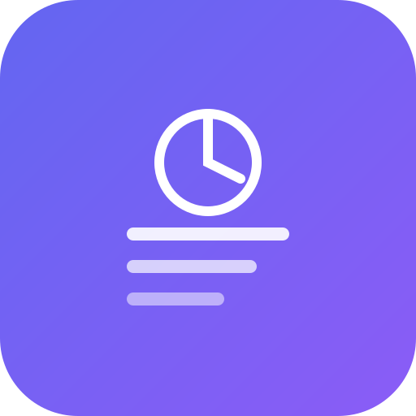

# 📱 DayFlow - Daily Planner & Task Manager

<p align="center">
  
</p>

<p align="center">
  <strong>Plan your day. Track your progress. Achieve your goals.</strong>
</p>

<p align="center">
  <a href="#features">Features</a> •
  <a href="#installation">Install</a> •
  <a href="#convert-to-apk">Get APK</a> •
  <a href="#development">Development</a>
</p>

---

## 🌟 About DayFlow

**DayFlow** is a beautifully designed productivity app that helps you organize your daily life with intelligent scheduling, task management, and comprehensive progress tracking. Whether you're a student, professional, or anyone looking to boost their productivity, DayFlow provides all the tools you need to stay on top of your day.

Unlike complex project management tools, DayFlow focuses on what matters most — **your personal productivity**. Plan your schedule in colorful time blocks, manage tasks with priorities and categories, track your daily/weekly/monthly progress with beautiful charts, and keep notes all in one place.

### ✨ Why Choose DayFlow?

- 🎯 **Simple yet powerful** — Everything you need, nothing you don't
- 📱 **Works everywhere** — Phone, tablet, desktop, or installed as an app
- 🔒 **100% private** — Your data stays on your device, no accounts needed
- 🌐 **Works offline** — Use it anywhere, anytime
- 💜 **Beautiful design** — Clean, modern interface that's a joy to use
- 📊 **Smart insights** — Visual progress reports help you understand your productivity patterns

---

## 🚀 Features

### 📋 Smart Task Management
- Create tasks with titles, descriptions, and due dates
- Set priority levels (Low, Medium, High)
- Organize by categories: Work, Personal, Health, Learning, Finance
- Track task status: To Do → In Progress → Done
- Filter and search through your tasks instantly

### 📅 Visual Daily Schedule
- Plan your day with colorful time blocks (6 AM - 9 PM)
- Navigate between days with ease
- Mark blocks as completed as you go
- Visual progress indicator for the day
- Color-code different activities for quick recognition

### 📊 Progress Reports & Analytics
- **Daily View** — See what you accomplished today
- **Weekly View** — Review your week's productivity
- **Monthly View** — Long-term progress tracking
- Beautiful charts: Bar charts, pie charts, and line graphs
- Track completion rates, streaks, and category distribution
- Monitor schedule adherence over time

### 📝 Quick Notes
- Capture thoughts and ideas instantly
- Color-code your notes for organization
- Search through all your notes
- Edit and update anytime

### 🏠 Smart Dashboard
- At-a-glance overview of your day
- Upcoming schedule blocks
- High-priority tasks that need attention
- Overall progress percentage
- Quick stats and shortcuts

---

## 📲 Installation

### Option 1: Install as PWA (Recommended)

DayFlow is a **Progressive Web App (PWA)**, which means you can install it directly on your phone or computer like a native app!

**On Android (Chrome/Edge):**
1. Open DayFlow in your browser
2. Tap the menu (⋮) or look for the install banner
3. Tap "Install app" or "Add to Home Screen"
4. DayFlow is now installed on your phone!

**On iPhone (Safari):**
1. Open DayFlow in Safari
2. Tap the Share button (⬆️)
3. Scroll down and tap "Add to Home Screen"
4. Tap "Add" — DayFlow is now on your home screen!

**On Desktop (Chrome/Edge):**
1. Open DayFlow in your browser
2. Click the install icon in the address bar (or menu → Install)
3. DayFlow will open in its own window like a desktop app

### Option 2: Use in Browser

Simply visit the deployed URL and use DayFlow directly in your web browser. All features work the same way!

---

## 📦 Convert to APK (Android)

Want a real Android APK file? Here's how to convert DayFlow into an installable APK — **no coding required!**

### Method 1: PWABuilder (Easiest - No Coding)

[PWABuilder](https://www.pwabuilder.com/) is a free tool by Microsoft that converts web apps to APKs.

1. **Deploy DayFlow** to a URL (see [Deployment](#deployment) below)
2. Go to [pwabuilder.com](https://www.pwabuilder.com/)
3. Enter your deployed URL
4. Click **"Package for Stores"** → **"Android"**
5. Download the generated APK file
6. Transfer to your phone and install!

### Method 2: Bubblewrap (Advanced)

[Bubblewrap](https://github.com/GoogleChromeLabs/bubblewrap) is Google's official tool for creating Trusted Web Activities (TWAs).

```bash
# Install Bubblewrap
npm i -g @bubblewrap/cli

# Initialize with your deployed URL
bubblewrap init --manifest=https://your-domain.com/manifest.json

# Build the APK
bubblewrap build
```

### Method 3: Capacitor (For Custom Builds)

If you want to customize the native app further:

```bash
# Install Capacitor
npm install @capacitor/core @capacitor/cli
npx cap init DayFlow com.dayflow.app

# Add Android platform
npm install @capacitor/android
npx cap add android

# Build and sync
npm run build
npx cap sync

# Open in Android Studio
npx cap open android
```

Then build the APK from Android Studio.

---

## 🌐 Deployment

Deploy DayFlow to make it accessible from anywhere:

### GitHub Pages (Free)

1. Push this repo to GitHub
2. Go to **Settings** → **Pages**
3. Select **GitHub Actions** as the source
4. Create `.github/workflows/deploy.yml`:

```yaml
name: Deploy to GitHub Pages
on:
  push:
    branches: [main]
jobs:
  deploy:
    runs-on: ubuntu-latest
    steps:
      - uses: actions/checkout@v3
      - uses: actions/setup-node@v3
        with:
          node-version: 18
      - run: npm install
      - run: npm run build
      - uses: peaceiris/actions-gh-pages@v3
        with:
          github_token: ${{ secrets.GITHUB_TOKEN }}
          publish_dir: ./dist
```

### Vercel (Free)

1. Push to GitHub
2. Go to [vercel.com](https://vercel.com)
3. Import your repo
4. Click Deploy — Done!

### Netlify (Free)

1. Push to GitHub
2. Go to [netlify.com](https://netlify.com)
3. Drag and drop the `dist` folder, or connect your repo
4. Your site is live!

---

## 💻 Development

### Prerequisites

- Node.js 18+ installed on your computer
- A code editor (VS Code recommended)
- Git for version control

### Getting Started

```bash
# Clone the repository
git clone https://github.com/yourusername/dayflow.git
cd dayflow

# Install dependencies
npm install

# Start development server
npm run dev

# Build for production
npm run build

# Preview production build
npm run preview
```

### Tech Stack

- **React 18** — UI framework
- **TypeScript** — Type-safe code
- **Tailwind CSS** — Modern styling
- **Vite** — Lightning-fast build tool
- **Recharts** — Beautiful data visualization
- **Lucide Icons** — Clean icon library
- **date-fns** — Date manipulation
- **LocalStorage** — No database needed!

### Project Structure

```
dayflow/
├── public/           # Static assets & PWA files
│   ├── manifest.json # PWA configuration
│   ├── sw.js         # Service worker
│   └── icon.svg      # App icon
├── src/
│   ├── components/   # React components
│   │   ├── Dashboard.tsx
│   │   ├── Schedule.tsx
│   │   ├── Tasks.tsx
│   │   ├── Progress.tsx
│   │   ├── Notes.tsx
│   │   └── InstallPrompt.tsx
│   ├── App.tsx       # Main app component
│   ├── types.ts      # TypeScript types
│   ├── store.ts      # LocalStorage helpers
│   └── main.tsx      # Entry point
└── index.html        # HTML template
```

---

## 🔐 Privacy & Data

DayFlow is designed with your privacy in mind:

- ✅ **No account required** — Start using immediately
- ✅ **No data collection** — We don't track anything
- ✅ **Local storage only** — Your data stays on your device
- ✅ **No internet needed** — Works completely offline
- ✅ **No third-party services** — No analytics, no ads
- ✅ **Open source** — See exactly what the app does

Your tasks, schedules, notes, and progress data are stored locally in your browser. Clear your browser data to reset everything.

---

## 🤝 Contributing

Contributions are welcome! Feel free to:

- Report bugs
- Suggest new features
- Submit pull requests
- Improve documentation

---

## 📄 License

This project is open source and available under the MIT License.

---

## 🙏 Acknowledgments

Built with modern web technologies and a passion for productivity.

---

<p align="center">
  <strong>Made with 💜 for productive people everywhere</strong>
</p>

<p align="center">
  <sub>Keywords: daily planner, task manager, productivity app, schedule planner, time management, to-do list, progress tracker, habit tracker, goal setting, free planner app, offline planner, PWA, mobile app, android app</sub>
</p>
